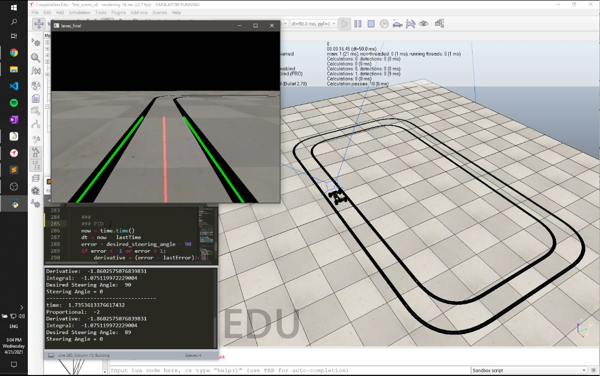

# autonomous-lane-tracking

This was my final project for the course “Control Engineering”, which consists of developing an autonomous mobile Ackerman robot, capable of lane tracking by just using a camera as feedback for a control system.
